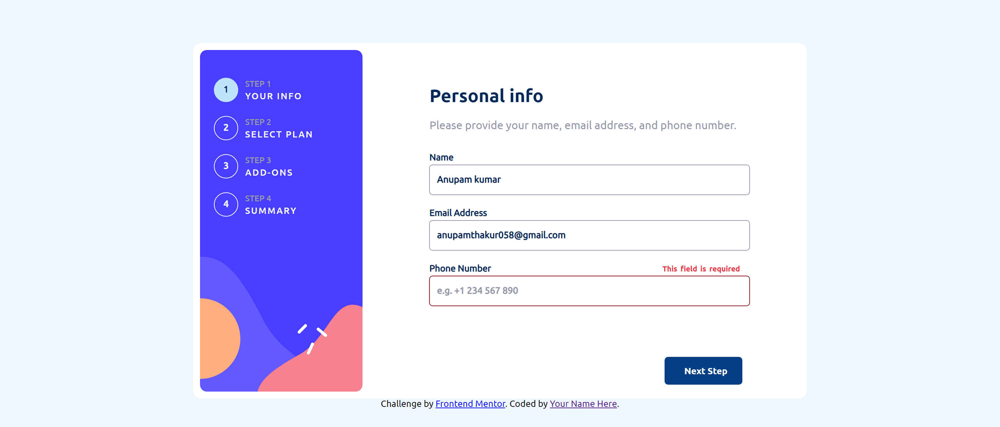

# Frontend Mentor - Multi-step form solution

This is a solution to the [Multi-step form challenge on Frontend Mentor](https://www.frontendmentor.io/challenges/multistep-form-YVAnSdqQBJ). Frontend Mentor challenges help you improve your coding skills by building realistic projects.

## Table of contents

- [Overview](#overview)
  - [The challenge](#the-challenge)
  - [Screenshot](#screenshot)
- [My process](#my-process)
  - [Built with](#built-with)
  - [What I learned](#what-i-learned)
  - [Continued development](#continued-development)
 
- [Author](#author)

## Overview

### The challenge

Users should be able to:

- Complete each step of the sequence
- See a summary of their selections on the final step and confirm their order
- View the optimal layout for the interface depending on their device's screen size
- See hover and focus states for all interactive elements on the page

### Screenshot

- desktop screenshot as per 1440px screenSize

- screenShot as per screenSize 375px

.png>)
.png>)
.png>)
.png>)
.png>)

## My process

### Built with

- Semantic HTML5 markup
- CSS custom properties
- Flexbox
- CSS Grid

### What I learned

by doing frontend mentor's projects i got knowledge about how the actual websites are works and everytime
by doing projects it help me in sharpen my coding skills.  
i have learned the importants of sequencing.

### Continued development

in future i want to master the javaScript.yet i'm not completely comfortable with javaScript concept like
try catch method,promises,json etc. so i want to make good hold on it in future.

## Author

- Frontend Mentor - [@Vatukah](https://www.frontendmentor.io/profile/Vatukah)
